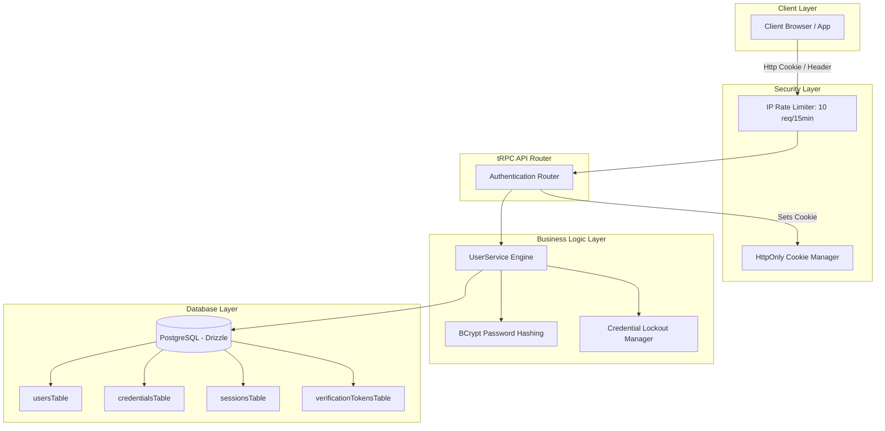

# Technical Specification: Enterprise-Grade Authentication System

This document outlines the complete architectural features, endpoints, security mechanisms, database models, and unit test suites implemented for the authentication and session management engine.

---

## 🏛️ System Architecture Overview

The system uses a highly secure, modern, multi-tiered design designed to mitigate all standard OWASP Top 10 vulnerabilities while offering a fluid developer experience with TypeScript, Zod, Drizzle, and tRPC.



---

## 🚦 Security & Compliance Safeguards

### 1. Brute-Force & Credential Stuffing Throttling (Dual-Layered)
* **IP Rate Limiting (Network Layer):** Restricts standard and Google logins to a maximum of **10 attempts per 15 minutes** per IP address. Exceeded limits throw a `429 TOO_MANY_REQUESTS` error.
* **Credential Lockout (Application Layer):** If a specific account is targeted across rotating IP addresses, hitting **5 consecutive failed attempts** locks the credential hash for **15 minutes**.

### 2. NIST SP 800-63B Password Validation & Compromised Blacklist
* **Complexity Validation:** Enforces a minimum of 8 characters containing at least 1 uppercase letter, 1 lowercase letter, 1 number, and 1 special character.
* **Leak Dictionary Blacklisting:** Blocks registration, passwords resets, and password updates if a user attempts to select one of the most commonly cracked or leaked password dictionaries (e.g. `Password123!`).

### 3. Session Hijacking Defense (User-Agent Pinning)
* **Creation State Bind:** Captures and stores the User-Agent during session establishment.
* **Verification Check:** Every query to `/getCurrentUser` extracts the active request header. If a drastic mismatch is found (e.g., cell phone iPhone signature attempting to access a session registered to a Windows Desktop), the system logs a high-severity warning, **deletes (revokes) the session instantly** from the database, and forces a logout.

### 4. SOC 2 Type II Structured Security Audit Log
* All critical events generate structured JSON output directly to stdout for direct SIEM integration (Datadog, Splunk, CloudWatch):
  ```json
  {"timestamp":"2026-05-20T07:35:45.926Z","event":"AUTH_SIGNUP","userId":"anonymous","ipAddress":"127.0.0.1","userAgent":"Mozilla/5.0","success":false,"reason":"This password is listed in databases of commonly compromised passwords. Please choose a more secure, unique password."}
  ```

---

## 🔌 API Endpoints Directory (tRPC Procedures)

All mutation and query schemas are declared under `packages/trpc/server/routes/auth/model.ts` and mapped securely via `route.ts`.

### 1. Sign Up & Activation
* **`/createUserWithEmailAndPassword` (POST):** Registers new email credentials, enforces blacklists, binds transactions, generates a unique activation token, and dispatches a verification email.
* **`/verifyEmail` (POST):** Validates the high-entropy 24-hour verification token. Upon success, activates the profile and marks the token used.
* **`/resendVerificationEmail` (POST):** Dispatches a fresh activation token. Includes a **60-second cooldown block** to mitigate SMTP spammers.

### 2. Authenticating Flows
* **`/loginWithEmailAndPassword` (POST):** Resolves standard email logins. Returns a rolling session token, resets lockout cooldown counts, and sets a secure browser cookie.
* **`/logout` (POST):** Instantly deletes the active session from the database and clears HttpOnly cookie keys.

### 3. Google OAuth & Account Linking
* **`/getGoogleAuthUrl` (GET):** Generates secure redirect links with integrated scopes.
* **`/loginWithGoogle` (POST):** Exchanges authorization codes. Seamlessly resolves existing OAuth links, links Google accounts to active email/password profiles, or registers brand new users.

### 4. Session & Device Management
* **`/getCurrentUser` (GET):** Authenticates active requests, performs rolling session extends (extends by 30 days if < 15 days remain), and runs User-Agent hijacking checks.
* **`/getActiveSessions` (GET):** Lists logged-in devices with operating system, browser name, device type, last active timestamp, IP, and an `isCurrent` active flag.
* **`/revokeSessionById` (POST):** Terminate remote sessions selectively. If the active device terminates itself, the cookie is instantly cleared.
* **`/refreshSession` (POST):** Manual rolling database expiration extension.

### 5. Profile & Credentials Refinements
* **`/changePassword` (POST):** Updates passwords cleanly and **clears all other active device connections** to protect the account from compromise.
* **`/updateProfile` (POST):** Safely updates display names.
* **`/deleteAccount` (POST):** Performs soft-deletes and instantly drops all device session rows.

---

## 🗄️ Database Schemas Overview

Mapped cleanly inside Drizzle ORM models:

### 1. Users Table (`usersTable`)
* Tracks standard profile fields, soft-delete states (`deletedAt`), activity states (`isActive`), and email verification timestamps.

### 2. Credentials Table (`credentialsTable`)
* Stores highly secure bcrypt password hashes, concurrent failed attempts, and lockout active timestamps (`lockedUntil`).

### 3. Sessions Table (`sessionsTable`)
* Holds SHA-256 hashed session identifiers, operating system/browser/device type metadata (`metadata`), creator IP Addresses (`ipAddress`), and expirations (`expiresAt`).

### 4. Verification & Reset Tables
* Map one-use high-entropy tokens to prevent replay attacks (`isUsed`, `usedAt`, `expiresAt`).

---

## 🧪 Vitest Test Suite Coverage

A comprehensive suite of **29 robust unit tests** asserts every feature and security constraint with mock isolation.

```bash
✓ user/auth.test.ts (29 tests) 3456ms
      ✓ should reject weak passwords lacking uppercase letters 19ms
      ...
      ✓ should revoke the session and return null if User-Agent mismatch is detected (Session Hijack Prevention) 6ms
```
